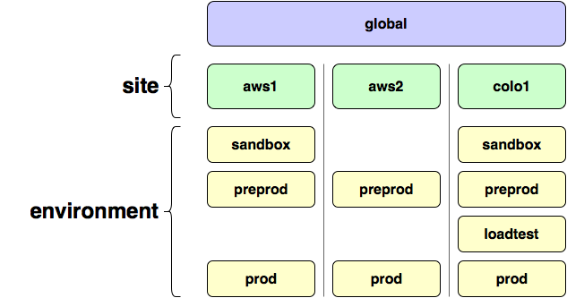

Genesis - A BOSH Deployment Paradigm
====================================

Deploying across multiple environments can be a daunting task,
especially when it comes to ensuring that commonalities like IaaS
properties and networking are common where they should be and
specialized where they shouldn't.

An ideal deployment pipeline might look something like this:


Where sandbox is used to validate that deployments are sane, test
stemcell upgrades, etc., preprod enables integration and
acceptance testing, and prod is the thing that shouldn't break.
For reasons of sanity, these environments should all be deployed
on similar infrastructure, like Amazon EC2 or a hosted VMWare ESXi
cluster.

Challenges arise when you need to make changes to the "common
elements" of these different environments, like what AWS region
the deployments should be done in, or what version of the BOSH
release is being deployed.  Without intense discipline, these
different environments can easily drift, which may have disastrous
consequences.

Genesis changes this by breaking up your BOSH configuration
manifest along three logical strata: _global_, _site_ and
_environment_.



At the top, the most generic configuration is considered
**global**.  The general outline of your deployment, what jobs run
on what instances, is specified here, and used everywhere.
Defaults for job and global properties are defined here as well.

Beneath that, the **site** stratum defines the composition and
configuration of your infrastructure.  For example, if you are
deploying on the Amazon AWS EC2 platform, you would set your
S3/EC2 credentials, which AMI to use as a stemcell, etc. here.

At the lowest and most specific level, **environment** provides a
place to set the networking for a single deployment, and override
properties and scaling factors here.  Your sandbox environment
probably doesn't need to run as many instances as production, and
they are most likely in different subnets.

Genesis combines these different levels of configuration to
produce a single BOSH manifest for each environment, and uses a
tool called [spruce][spruce] to handle overrides and references in
a straightforward and predictable manner.

## Installation

To install Genesis, you just need to put `bin/genesis` somewhere
in your path and make it executable, like this:

```
curl https://raw.githubusercontent.com/starkandwayne/genesis/master/bin/genesis > ~/bin/genesis
chmod 0755 ~/bin/genesis
```

(assuming that `~/bin` is in your `$PATH`, which it really ought
to be)

If you have privileged access and wish to install Genesis for all
users, you can put it in `/usr/local/bin` or `/usr/bin`

[spruce]: https://github.com/geofffranks/spruce
