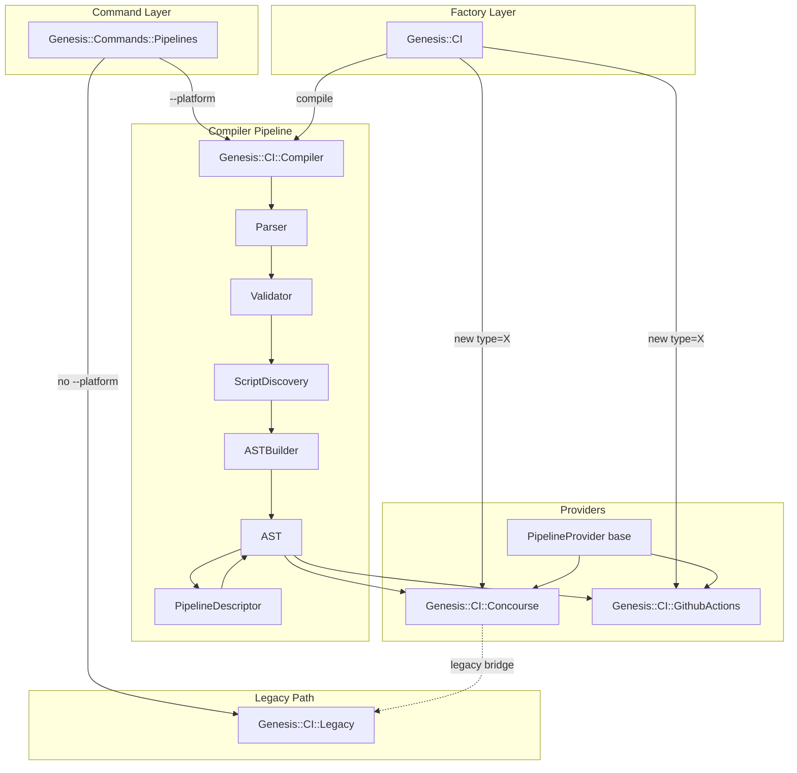

# Architecture Overview

The Genesis CI system has two parallel code paths for generating deployment
pipelines: a legacy path and a modern compiler pipeline. Both paths are
active in the codebase and serve different entry points. Understanding
how they coexist is essential before modifying any part of the system.

## Two Code Paths

The legacy code path is activated when an operator runs `genesis repipe`
without the `--platform` flag. It calls directly into `Genesis::CI::Legacy`,
a monolithic 1740-line module that parses `ci.yml`, evaluates spruce
operators, and generates Concourse pipeline YAML through string
concatenation. This path only supports Concourse and has been in production
for years.

The compiler pipeline is activated when `--platform` is passed to `repipe`,
`graph`, or `describe`. It runs configuration through a six-stage pipeline:
Parser, Validator, ScriptDiscovery, ASTBuilder, PipelineDescriptor, and
Provider. This path supports multiple platforms and produces a structured
AST intermediate representation.

Both paths are invoked from `Genesis::Commands::Pipelines`, the command
handler module. The routing decision happens in the `repipe` subroutine
at the point where it checks for the `platform` option.

## Module Map



## File Locations

All CI modules live under `lib/Genesis/CI/` in the Genesis CLI repository.

```
lib/Genesis/CI.pm                              # Factory + trait interface
lib/Genesis/CI/Legacy.pm                       # Monolithic legacy generator
lib/Genesis/CI/Compiler.pm                     # Compiler orchestrator
lib/Genesis/CI/Compiler/Parser.pm              # Config file parser
lib/Genesis/CI/Compiler/Validator.pm           # Config validator
lib/Genesis/CI/Compiler/ScriptDiscovery.pm     # Script metadata discovery
lib/Genesis/CI/Compiler/ASTBuilder.pm          # AST construction
lib/Genesis/CI/Compiler/AST.pm                 # AST data structure
lib/Genesis/CI/Compiler/PipelineDescriptor.pm  # Generic pipeline builder
lib/Genesis/CI/Compiler/PipelineProvider.pm    # Provider abstract base
lib/Genesis/CI/Compiler/Providers/Concourse.pm # Concourse provider
lib/Genesis/CI/Compiler/Providers/GithubActions.pm # GitHub Actions provider
```

The command handler is at `lib/Genesis/Commands/Pipelines.pm` and the CLI
command definitions are in `bin/genesis`.

## Entry Points

There are three ways code enters the CI system:

The primary entry point is `Genesis::Commands::Pipelines::repipe()`, called
when an operator runs `genesis repipe`. This function inspects the
`--platform` option and routes to either the legacy path or the compiler.
The `graph()` and `describe()` functions in the same module follow the
same routing pattern.

The secondary entry point is `Genesis::CI->new(type => 'concourse')`, the
factory method on the `Genesis::CI` class. This constructs a provider
instance through the trait interface and calls `init()` on the provider
class. The trait interface exposes `parse()`, `generate()`, and `deploy()`
methods. However, no code in the CLI command layer currently calls this
entry point. The commands call `Genesis::CI::Compiler->new()->compile()`
directly instead.

The third entry point is `Genesis::CI->compile(provider => 'concourse')`,
a convenience class method that constructs a `Genesis::CI::Compiler` and
runs the full pipeline. This is also not called by the CLI command layer,
which constructs the compiler directly.

## Data Flow

Configuration data flows through the system in a single direction, being
progressively transformed at each stage:

```
YAML files
  → parsed config (Perl hashref with normalized structure)
    → validated config (same hashref, errors collected)
      → scripts metadata (hashref of script_id → metadata)
        → AST source representation (Genesis-specific: targets, integrations, workflows)
          → AST generic pipeline (platform-agnostic: resource_types, resources, jobs, groups)
            → provider output (platform-specific YAML strings)
```

Each transformation is performed by a dedicated module. The AST is the
central data structure and it has two layers: a source representation
that holds Genesis-specific concepts, and a generic pipeline that holds
fully-resolved CI primitives. The PipelineDescriptor is the boundary
module that converts from one layer to the other.

## Dual Inheritance in Providers

Both `Genesis::CI::Concourse` and all other providers inherit
from two parent classes:

```perl
use parent 'Genesis::CI', 'Genesis::CI::Compiler::PipelineProvider';
```

The `Genesis::CI` parent provides the trait interface (`init`, `parse`,
`generate`, `deploy`, `platform_name`, `file_extension`). The
`PipelineProvider` parent provides the compiler interface
(`generate_from_ast`, `output_files`) plus shared helpers like `dump_yaml`,
`git_uri`, `secret_ref`, and `topological_sort`.

This dual inheritance means each provider can be used in two modes. In
trait mode, you call `init()`, then `parse()`, then `generate()`. In
compiler mode, you call `new(ast => $ast)` and then `generate_from_ast()`.
The compiler pipeline uses the second mode exclusively.

## Concourse Legacy Bridge

The Concourse provider has a special bridge mechanism for legacy-sourced
ASTs. When the compiler pipeline processes a `ci.yml` file, the parser
normalizes it into the multi-file structure, but the ASTBuilder preserves
the raw legacy data in `$ast->provider_config->{concourse}{_legacy_pipeline_raw}`.

When `Genesis::CI::Concourse::generate_from_ast()` detects this legacy
marker and a `$self->{top}` object is available, it calls
`_generate_from_legacy_ast()` which reconstructs the original `$P` hashref
that `Legacy::generate_pipeline_concourse_yaml()` expects and delegates
to it. This ensures that legacy configurations produce bit-identical output
regardless of whether they go through the compiler pipeline or the direct
legacy path.

For non-legacy ASTs (from the multi-file `.genesis/ci/` format), the
Concourse provider calls `_generate_native()` which serializes the
generic pipeline from `PipelineDescriptor` directly to YAML.
