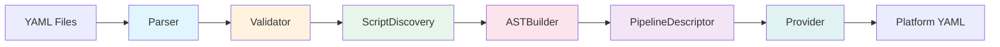

# Compiler Pipeline

The compiler pipeline transforms CI configuration files into
platform-specific pipeline definitions through six sequential stages. Each
stage has a dedicated module, takes input from the previous stage, and
produces output for the next. The `Genesis::CI::Compiler` module
orchestrates the stages.

## Pipeline Overview



## Stage 1: Parser

**Module:** `Genesis::CI::Compiler::Parser`

**Input:** File paths (either a `.genesis/ci/` directory or a single `ci.yml`)

**Output:** A Perl hashref with normalized configuration

The parser detects which configuration format is present and loads it
accordingly. For the multi-file format, it loads `pipeline.yml`,
`targets.yml`, `integrations.yml`, and optionally `scripts/manifest.yml`
and any files under `provider-config/`. For the legacy format, it loads
the single `ci.yml` file and normalizes its contents into the same
structure that the multi-file format produces.

Every file is loaded through `spruce merge`, which means spruce operators
like `(( grab ... ))`, `(( vault ... ))`, and `(( concat ... ))` are
evaluated at parse time. This is significant because it means the parsed
configuration contains resolved values, not spruce expressions. The one
exception is when `--skip-vault` is used, in which case vault operators
remain unresolved and appear as their literal `(( vault ... ))` form.

The legacy normalization is extensive. The parser converts `boshes` into
a `targets` structure with `type` and `connection` fields. It converts
`vault`/`git`/`slack`/`email`/`locker` into a unified `integrations`
structure. It parses the layout DSL into workflow definitions with
`auto_patterns`, `environments`, and `will_trigger` maps. The original
raw legacy data is preserved in `_legacy_raw` for use by the legacy
bridge in the Concourse provider.

The parsed output always contains these keys:

```perl
{
  pipeline        => { metadata => {...}, branches => {...}, workflows => {...}, configuration => {...} },
  targets         => { targets => { env_name => {...}, ... } },
  integrations    => { vault => {...}, source_control => {...}, notifications => [...], ... },
  scripts         => { ... },
  provider_config => { ... },
  _source_format  => 'legacy' | 'multi-file',
  _source_path    => '/path/to/source',
  _legacy_raw     => { ... },  # Only present for legacy format
}
```

### Layout DSL Parsing

The layout DSL parser in `_parse_layout_dsl()` processes the text line by
line. It strips comments, collapses whitespace, and splits on semicolons
and newlines to produce a list of "rules." Each rule is either an `auto`
directive (which records glob patterns for auto-deployment) or an
environment chain (sequences of environment names connected by `->` arrows).

For each chain, the parser validates that every environment name exists in
`boshes` and builds a `will_trigger` map recording which environment
triggers which other environments. The output for each layout is:

```perl
{
  auto_patterns => ['sandbox-*', 'preprod-*'],
  environments  => ['sandbox', 'staging', 'prod'],
  will_trigger  => { sandbox => ['staging'], staging => ['prod'] },
  _raw_source   => 'auto sandbox-* ; sandbox -> staging -> prod',
}
```

## Stage 2: Validator

**Module:** `Genesis::CI::Compiler::Validator`

**Input:** Parsed configuration hashref

**Output:** Same hashref (validated in place); errors and warnings collected

The validator performs structural checks, required-field validation,
allowed-key enforcement, and cross-reference validation. It dispatches to
`_validate_legacy()` or `_validate_multi_file()` based on the
`_source_format` field.

For legacy format, the validator checks every section of the original
`pipeline` structure: required top-level keys (`name`, `vault`, `git`,
`boshes`), vault URL presence, git authentication mode (SSH key XOR
username/password), BOSH director credentials (unless create-env), valid
notification configuration (at least one of slack or email), layout
validity, and allowed keys at every level. The allowed-key check at the
top level permits exactly these keys: `name`, `public`, `tagged`, `errands`,
`ocfp`, `vault`, `git`, `slack`, `email`, `boshes`, `task`, `layout`,
`layouts`, `groups`, `debug`, `locker`, `unredacted`, `notifications`,
`auto-update`, `registry`, `require-passed-caches`.

For multi-file format, the validator checks the pipeline section (metadata
name required, branches live required, workflows required), targets section
(connection URL required for bosh-director type), integrations section
(vault and source_control required), and cross-references (workflow trigger
patterns must match at least one target, script references must resolve).

The validator also checks for DAG cycles in workflow graphs using a standard
depth-first search with temporary marks. If a cycle is found, an error is
recorded with the offending node name.

Errors and warnings are collected separately. The caller checks
`has_errors()` and `has_warnings()` after validation. Errors are fatal
(compilation stops), warnings are informational.

## Stage 3: ScriptDiscovery

**Module:** `Genesis::CI::Compiler::ScriptDiscovery`

**Input:** Parsed configuration hashref

**Output:** Hashref of `script_id => metadata`

Script discovery searches for script metadata from three sources in priority
order. First, it loads explicit declarations from `scripts/manifest.yml` in
the parsed config. Second, it scans `scripts/` and `.genesis/ci/scripts/`
for `.sh` files that contain `@genesis-script` inline annotations. Third,
for any remaining undiscovered scripts, it infers metadata from the filename.

Each discovered script gets a metadata record with these fields:

```perl
{
  id           => 'deploy/genesis-deploy',
  description  => 'Execute Genesis deployment',
  path         => 'scripts/deploy.sh',
  executor     => 'bash',
  version      => '1.0',
  requirements => [{ tool => 'genesis-cli', version => '>=3.1.0' }],
  inputs       => [{ name => 'deployment-repo', type => 'git-repository', required => 1 }],
  outputs      => [{ name => 'manifests', type => 'directory', path => '.genesis/manifests/' }],
  environment  => { required => ['CURRENT_ENV'], optional => ['GENESIS_TRACE'] },
  timeout      => '60m',
  exit_codes   => { 0 => 'success', 1 => 'error' },
  privileged   => 0,
}
```

The manifest has highest priority and overrides any inline annotations.
Inline annotations override filename-based inference. The `_validate_script`
method ensures all required fields have defaults and optionally checks that
referenced script files exist on disk.

For legacy `ci.yml` configurations, the scripts section is typically empty
because legacy pipelines use Genesis built-in CI commands (`ci-pipeline-deploy`,
`ci-generate-cache`, etc.) rather than custom scripts.

## Stage 4: ASTBuilder

**Module:** `Genesis::CI::Compiler::ASTBuilder`

**Input:** Parsed configuration and discovered scripts

**Output:** `Genesis::CI::Compiler::AST` object

The ASTBuilder constructs the AST source representation from the parsed
configuration. It dispatches to `_build_from_legacy()` or
`_build_from_multi_file()` based on the source format.

For legacy format, the builder extracts metadata (pipeline name, version,
source type), branches, integrations (passed through from the parser),
targets (passed through from the parser), and builds workflow definitions
from the parsed layout data. The workflow builder is the most complex part:
it computes aliases from `boshes`, determines which environments auto-deploy
by matching `auto_patterns` against environment names using glob expansion,
builds a `triggers` map (the inverse of `will_trigger`), and constructs a
DAG with nodes and edges.

Each workflow node contains:

```perl
{
  stage_name  => 'sandbox',
  target_name => 'sandbox',
  alias       => 'sandbox',
  genesis_env => 'sandbox',
  auto        => 1,
  type        => 'deployment',
}
```

Each edge contains `{ from => 'sandbox', to => 'staging' }`.

The builder also preserves legacy-specific data in a `_legacy` key on each
workflow. This data includes the original `environments`, `auto_envs`,
`aliases`, `genesis_envs`, `will_trigger`, and `triggers` maps. The
Concourse legacy bridge uses this data to reconstruct the `$P` hashref
for delegation to `Legacy::generate_pipeline_concourse_yaml()`.

For the multi-file format, the builder passes most data through directly
but constructs workflow graphs from stage definitions. If stages are
provided as a list, `_build_workflow_graph()` creates a sequential DAG
where each stage triggers the next. If an explicit graph is provided, it
is used as-is.

The builder also handles `provider_config`, embedding the legacy raw data
under `{concourse}{_legacy_pipeline_raw}` so the Concourse provider can
detect it.

## Stage 5: PipelineDescriptor

**Module:** `Genesis::CI::Compiler::PipelineDescriptor`

**Input:** AST with populated source representation

**Output:** Generic pipeline hashref stored in the AST via `set_pipeline()`

This is the largest and most important module in the compiler (~1300 lines).
It is the boundary between Genesis domain logic and generic CI pipeline
generation. All Genesis-specific knowledge about deployment jobs, cache
generation, locker integration, auto-update mechanics, notification wiring,
and environment file conventions lives here.

The `describe()` method produces a hashref with four arrays:

```perl
{
  resource_types => [...],  # Concourse resource type definitions
  resources      => [...],  # Git, notification, BOSH config, locker resources
  jobs           => [...],  # Notify and deploy jobs for each environment
  groups         => [...],  # Pipeline UI groupings
  graphviz       => '...',  # DOT source for visualization
  description    => '...',  # Human-readable text description
}
```

The generation process iterates over each workflow in the AST. For each
workflow, it extracts unified data from the graph (environments, aliases,
auto flags, trigger relationships), then generates per-environment resources
(Git change watchers, cache watchers, BOSH config resources, locker
resources) and per-environment jobs (notification jobs for non-auto envs,
deployment jobs for all envs).

Deployment jobs are the most complex. Each one contains resource gets
(with trigger and passed constraints), lock acquisition steps, a deploy
task with full environment variable configuration, errand tasks, a cache
generation task, cache push steps for downstream environments, notification
on-failure and on-success hooks, and lock release in an ensure block.

The module also generates auto-update resources and jobs when configured,
custom or default pipeline groups, and graphviz/description output.

See [AST and PipelineDescriptor](ast-and-descriptor.md) for detailed
coverage of the two-layer design.

## Stage 6: Provider

**Module:** Provider-specific (e.g., `Genesis::CI::Concourse`)

**Input:** AST with populated generic pipeline

**Output:** Platform-specific YAML string(s)

The provider is the final stage. It takes the fully-resolved generic
pipeline from the AST and serializes it to the platform's native format.
For Concourse, this means emitting YAML with `groups`, `resources`,
`resource_types`, and `jobs` at the top level. For GitHub Actions, this
means emitting workflow YAML with `name`, `on`, and `jobs`.

Providers are intentionally thin. All Genesis-specific logic lives in
PipelineDescriptor, so providers only need to serialize the generic
pipeline to their platform's format.

The `Genesis::CI::Compiler` orchestrator calls `compile()` which runs
all six stages and returns:

```perl
{
  ast      => $ast_object,
  output   => { 'pipeline.yml' => $yaml_string },
  provider => $provider_object,
  parsed   => $parsed_config,
}
```

The command layer then decides what to do with the output: deploy it via
`fly`, write it to a directory, or print it to stdout.
