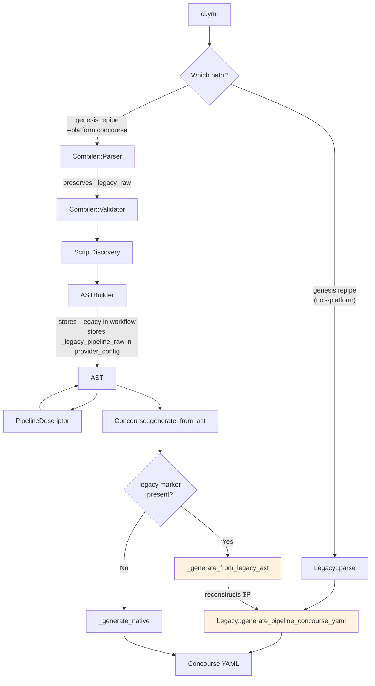

# Legacy Bridge

The Genesis CI system maintains full backward compatibility with the
original monolithic pipeline generator (`Genesis::CI::Legacy`). This
document explains how the legacy code interoperates with the modern
compiler pipeline, when the bridge is activated, and how data flows
between the two systems.

## Legacy Module Overview

`Genesis::CI::Legacy` is a self-contained module of approximately 1740
lines that handles every aspect of Concourse pipeline generation: parsing
`ci.yml`, evaluating the layout DSL, resolving environment relationships,
computing file paths, and emitting YAML through string concatenation with
embedded spruce operators.

The module exposes four public functions:

`parse($config_file, $top, $layout)` loads the configuration file through
`spruce merge`, validates required keys, normalizes defaults, parses the
layout DSL, and returns a `$pipeline` hashref along with the selected
layout name.

`generate_pipeline_concourse_yaml($pipeline, $top)` takes the parsed
hashref and generates the complete Concourse pipeline YAML as a string.
The output includes spruce operators like `(( grab ... ))` and
`(( inject ... ))` that are resolved by a final `spruce merge --prune
pipeline` pass.

`generate_pipeline_graphviz_source($pipeline)` produces a Graphviz DOT
string from the parsed pipeline.

`generate_pipeline_human_description($pipeline)` prints a human-readable
description of the pipeline to stdout.

## When Legacy is Used Directly

The legacy module is called directly (bypassing the compiler entirely) when
an operator runs `genesis repipe` without the `--platform` flag. In
`Genesis::Commands::Pipelines::repipe()`, the code checks for the
`platform` option. When it is absent, execution falls through to:

```perl
(my $pipeline, $layout) = Genesis::CI::Legacy::parse(get_options->{config}, $top, $layout);
my $yaml = Genesis::CI::Legacy::generate_pipeline_concourse_yaml($pipeline, $top);
```

This is the production code path that has been in use for years. The same
pattern applies to `graph()` and `describe()`.

## When the Bridge is Activated

The bridge is activated when all of these conditions are true:

1. The operator uses `--platform concourse` (activating the compiler pipeline)
2. The configuration source is a legacy `ci.yml` file (not `.genesis/ci/`)
3. The Concourse provider's `generate_from_ast()` is called

Under these conditions, the Parser reads `ci.yml` and normalizes it into
the multi-file structure. The ASTBuilder preserves the raw legacy data in
`$parsed->{_legacy_raw}` and stores it in the AST's provider config:

```perl
$provider_config->{concourse} = {
    _legacy_pipeline_raw => $parsed->{_legacy_raw}{pipeline},
};
```

When `Genesis::CI::Concourse::generate_from_ast()` runs, it checks for this
marker:

```perl
if ($source eq 'legacy'
    && $ast->provider_config->{concourse}
    && $ast->provider_config->{concourse}{_legacy_pipeline_raw}
    && $self->{top}) {
    return $self->_generate_from_legacy_ast($ast);
}
```

If detected, it calls `_generate_from_legacy_ast()` instead of
`_generate_native()`.

## How the Bridge Reconstructs Legacy Data

The `_generate_from_legacy_ast()` method reconstructs the `$P` hashref
that `Legacy::generate_pipeline_concourse_yaml()` expects. The raw pipeline
data from the AST provides the top-level structure. The workflow's `_legacy`
data provides the environment lists, auto-deploy flags, aliases, genesis
environment mappings, and trigger relationships.

```perl
my $P = {
    pipeline     => { %$raw_p },
    file         => $ast->metadata->{source_file} || 'ci.yml',
    envs         => $leg->{environments} || [],
    auto         => $leg->{auto_envs}    || [],
    aliases      => { %{$leg->{aliases}      || {}} },
    genesis_envs => { %{$leg->{genesis_envs} || {}} },
    will_trigger => { %{$leg->{will_trigger} || {}} },
    triggers     => ref($leg->{triggers}) eq 'HASH' ? { %{$leg->{triggers}} } : {},
};
```

The method also applies the same boolean defaults that `Legacy::parse`
applies (tagged, public, unredacted, ocfp, vault verify, task image/version/
privileged). Once the `$P` hashref is complete, it delegates to
`Legacy::generate_pipeline_concourse_yaml($P, $self->{top})`.

This ensures that legacy configurations produce identical output regardless
of whether they are processed through the compiler pipeline or the direct
legacy path.

## Data Flow Diagram



## The Native Path

When the configuration comes from the multi-file `.genesis/ci/` format,
there is no legacy raw data and no `_legacy_pipeline_raw` marker. In this
case, `generate_from_ast()` falls through to `_generate_native()`, which
reads the generic pipeline from the AST and serializes it directly:

```perl
sub _generate_native {
    my ($self, $ast) = @_;
    $self->_ensure_pipeline_resolved();
    my $pipeline = {
        groups         => $ast->groups,
        resources      => $ast->pipeline_resources,
        resource_types => $ast->resource_types,
        jobs           => $ast->jobs,
    };
    return "---\n" . $self->dump_yaml($pipeline) . "\n";
}
```

The `_ensure_pipeline_resolved()` method checks whether the generic
pipeline has been built. If not (which can happen when the Concourse
provider is used via the trait interface rather than the compiler), it
creates a PipelineDescriptor and runs `describe()` to populate the AST's
generic pipeline.

## Trait Interface Legacy Mode

The Concourse provider's trait interface methods (`parse()`, `generate()`,
`graphviz()`, `describe()`) also have a legacy delegation path. When the
provider is constructed with `_platform => 'legacy'` (via the `platform`
option), the trait methods delegate directly to `Legacy.pm` functions:

```perl
sub parse {
    my ($self) = @_;
    if ($self->{_platform} eq 'legacy') {
        my ($pipeline, $layout) = Genesis::CI::Legacy::parse(
            $self->{file}, $self->{top}, $self->{layout}
        );
        $self->{config} = $pipeline;
        $self->{layout} = $layout;
        return $self;
    }
    # ... native path ...
}
```

This means there are two distinct ways legacy code is reached: the bridge
path (compiler → AST → reconstructed $P → Legacy) and the trait path
(provider.parse() → Legacy::parse() directly). The bridge path preserves
the compiler's intermediates for debugging. The trait path is a shortcut
that skips the compiler entirely.

## Why the Bridge Exists

The bridge exists to guarantee output parity during the transition from
legacy to modern generation. The Legacy module produces YAML with specific
formatting, spruce operator placement, and ordering that operators have
come to expect. By routing legacy configurations back through
`Legacy::generate_pipeline_concourse_yaml()`, the system guarantees that
the output is identical regardless of which code path was taken.

As confidence in the native generator grows (through testing against real
deployment repositories), the bridge can eventually be removed and all
configurations can flow through PipelineDescriptor and `_generate_native()`.
