# Genesis Deploy Process Flow

```mermaid
flowchart TD
    A["🚀 genesis deploy env"] --> B["📝 Parse options & validate args"]

    B --> C{{"💾 Check cached deployment files<br/>(.genesis/manifests/)"}}
    C -->|"Files exist"| D["⚠️ Prompt to clear cache<br/>or use --clear"]
    C -->|"No cache"| E["🔧 Load environment<br/>with vault & bosh connections"]
    D --> E

    E --> F{{"📋 Check deployment<br/>reason requirement"}}
    F -->|"Required & missing"| G["❌ Bail: reason required"]
    F -->|"OK"| H["✅ Validate options for create-env"]

    H --> I["📊 Display deployment info<br/>(kit, version, target)"]
    I --> J{{"🤔 Use create-env?"}}

    J -->|"No (BOSH director)"| K["🔍 Check CPI config<br/>via hooks/cpi-config"]
    J -->|"Yes (standalone)"| S["⏭️ Skip BOSH director checks"]

    K --> K1[("📁 Write CPI config YAML<br/>to workdir")]
    K1 --> K2[("🌐 Upload config to<br/>BOSH director")]
    K2 --> L

    L["🔍 Check cloud config<br/>via hooks/cloud-config"] --> L1[("📁 Write cloud config YAML<br/>to workdir")]
    L1 --> L2[("📊 Compare with existing<br/>config on director")]
    L2 --> L3@{shape: 'das', label: "🌐 Upload config to<br/>BOSH director if changed"}
    L3 --> M

    S --> M
    M["🔍 Check secrets<br/>via Vault queries"] --> M1[("🔐 Query Vault<br/>for required secrets")]
    M1 --> N{{"🔧 Fix secrets needed?"}}

    N -->|"Yes & dry-run"| O["📋 Show what would be fixed"]
    N -->|"Yes & not dry-run"| P["🔧 Fix secrets automatically<br/>via safe/vault commands"]
    N -->|"No"| Q["📋 Check YAML files<br/>if GENESIS_CHECK_YAML_ON_DEPLOY"]

    O --> Q
    P --> Q

    Q --> Q1[("📄 Read environment files<br/>via actual_environment_files()")]
    Q1 --> Q2[("🌲 Process inheritance<br/>via genesis.inherits")]
    Q2 --> R

    R["✅ Validate manifest<br/>via spruce merge"] --> R1[("🔧 Run spruce merge<br/>on all YAML files")]
    R1 --> T

    T["🔍 Check release overrides"] --> U{{"🎯 Using BOSH director?"}}

    U -->|"Yes"| V["🔍 Check stemcells<br/>via bosh stemcells"]
    U -->|"No"| W["⏭️ Skip stemcell check"]

    V --> V1[("🌐 Query BOSH director<br/>for available stemcells")]
    V1 --> X{{"🔧 Fix stemcells needed?"}}
    X -->|"Yes & option enabled"| Y["🔧 Fix stemcells<br/>via bosh upload-stemcell"]
    X -->|"Yes & not enabled"| Z["❌ Bail: stemcell issues"]
    X -->|"No"| AA["✅ Preflight checks complete"]

    Y --> Y1[("📦 Download & upload<br/>stemcells to director")]
    Y1 --> AA
    W --> AA

    AA --> BB{{"✅ All preflight checks OK?"}}
    BB -->|"No"| CC["❌ Bail: preflight failed"]
    BB -->|"Yes"| DD["🎯 Pass to Genesis::Env->deploy"]

    DD --> EE["💾 Setup deployment cache<br/>(.genesis/manifests/)"]
    EE --> EE1[("📁 Create cache directory<br/>and state files")]
    EE1 --> FF

    FF["🚀 Run pre-deploy phase"] --> FF1[("🔧 Execute hooks/pre-deploy<br/>if present")]
    FF1 --> GG{{"🤔 Use create-env?"}}

    GG -->|"Yes"| HH["🏗️ _deploy_create_env<br/>via bosh create-env"]
    GG -->|"No"| II["🏗️ _deploy_to_bosh<br/>via bosh deploy"]

    HH --> HH1[("📄 Generate manifest<br/>& variables file")]
    HH1 --> HH2[("🔧 Run bosh create-env<br/>command")]
    HH2 --> JJ

    II --> II1[("📄 Generate deployment<br/>manifest")]
    II1 --> II2[("🌐 Run bosh deploy<br/>to director")]
    II2 --> JJ

    JJ["🎉 Run post-deploy phase"] --> JJ1[("🔧 Execute hooks/post-deploy<br/>if present")]
    JJ1 --> JJ2[("🔐 Store deployment data<br/>in Vault exodus")]
    JJ2 --> KK{{"✅ Deployment successful?"}}

    KK -->|"Yes"| LL["🎉 Success message
		 & exit 0"]
    KK -->|"No"| MM["❌ Bail: deployment failed"]

    %% Styling
    style A fill:#e1f5fe
    style DD fill:#f3e5f5
    style LL fill:#e8f5e8
    style MM fill:#ffebee
    style CC fill:#ffebee
    style G fill:#ffebee
    style Z fill:#ffebee

    %% File operations
    style K1 fill:#fff3e0
    style L1 fill:#fff3e0
    style Q1 fill:#fff3e0
    style EE1 fill:#fff3e0
    style HH1 fill:#fff3e0
    style II1 fill:#fff3e0

    %% Network operations
    style K2 fill:#e8f5e8
    style L3 fill:#e8f5e8
    style V1 fill:#e8f5e8
    style Y1 fill:#e8f5e8
    style II2 fill:#e8f5e8

    %% Vault operations
    style M1 fill:#f3e5f5
    style JJ2 fill:#f3e5f5

    %% Process execution
    style R1 fill:#fce4ec
    style FF1 fill:#fce4ec
    style HH2 fill:#fce4ec
    style JJ1 fill:#fce4ec
```

This flowchart shows the complete process that occurs when running `genesis deploy <env>`.

## Process Overview

The Genesis deploy process consists of several main phases:

### 1. Validation Phase
- Parse command options and validate arguments
- Handle cached deployment files from previous failed/interrupted deployments
- Load environment with vault and BOSH connections

### 2. Preflight Checks
- **CPI Config**: Validate and update CPI configuration (for BOSH director deployments)
- **Cloud Config**: Generate, compare, and upload cloud configuration
- **Secrets Check**: Validate all required secrets exist and are valid
- **Manifest Validation**: Ensure the generated manifest is viable
- **Release Overrides**: Check for and confirm any release version overrides
- **Stemcells**: Validate required stemcells are available on BOSH director

### 3. Deployment Phase
- Set up deployment cache for tracking progress
- Run pre-deploy hooks
- Execute deployment via either:
  - `bosh create-env` for standalone deployments
  - `bosh deploy` for BOSH director managed deployments
- Run post-deploy hooks

### 4. Completion
- Report deployment success or failure
- Clean up deployment cache
- Exit with appropriate status code

## Key Decision Points

- **Create-env vs BOSH Director**: Determines which checks are needed and deployment method
- **Dry-run Mode**: Shows what would happen without making changes
- **Fix Options**: Automatically repair issues with secrets, stemcells, etc.
- **Interactive vs Non-interactive**: Affects prompting behavior for confirmations

## Error Handling

The process includes multiple bail-out points where deployment stops if:
- Required deployment reason is missing
- Preflight checks fail (CPI, cloud config, secrets, etc.)
- User cancels during confirmation prompts
- BOSH deployment command fails
