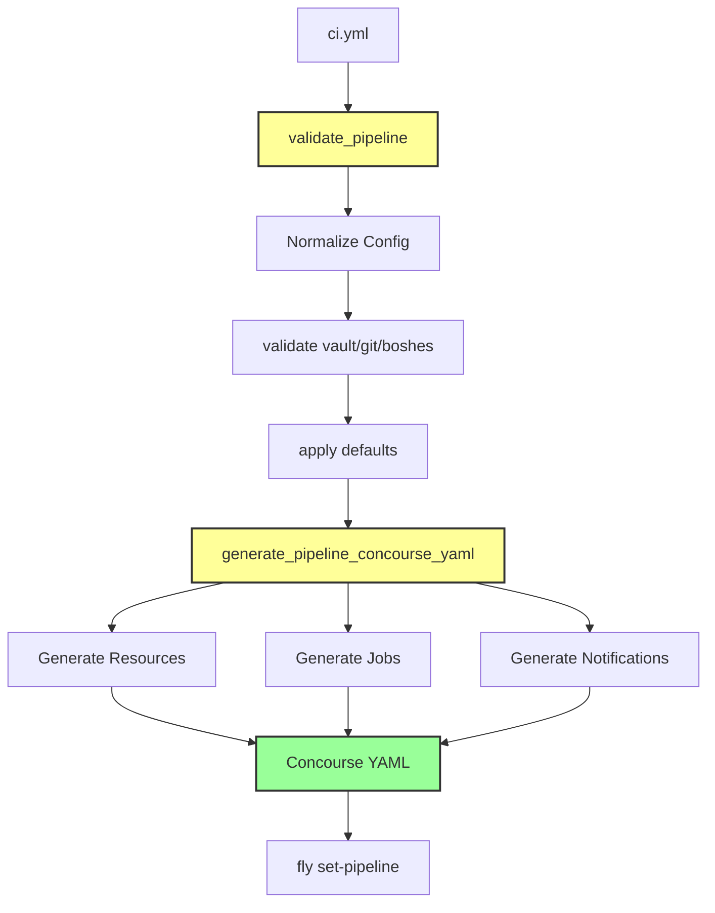
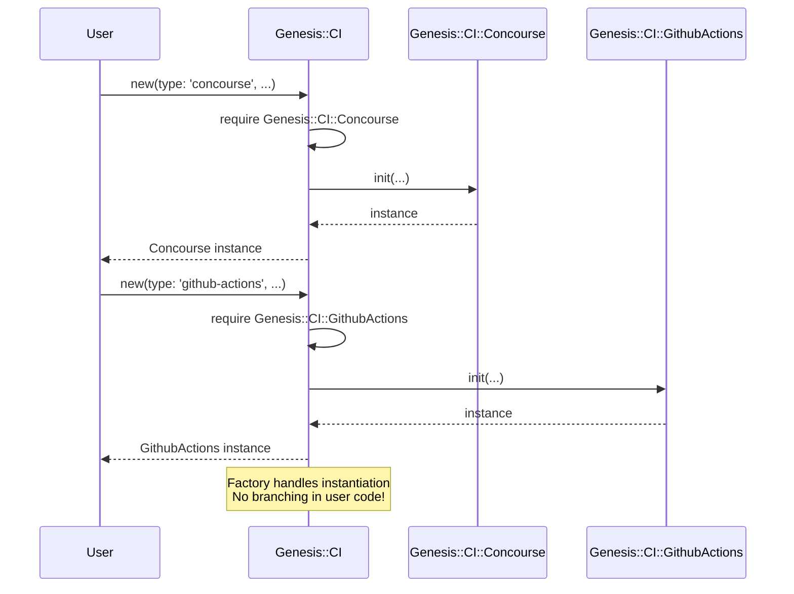
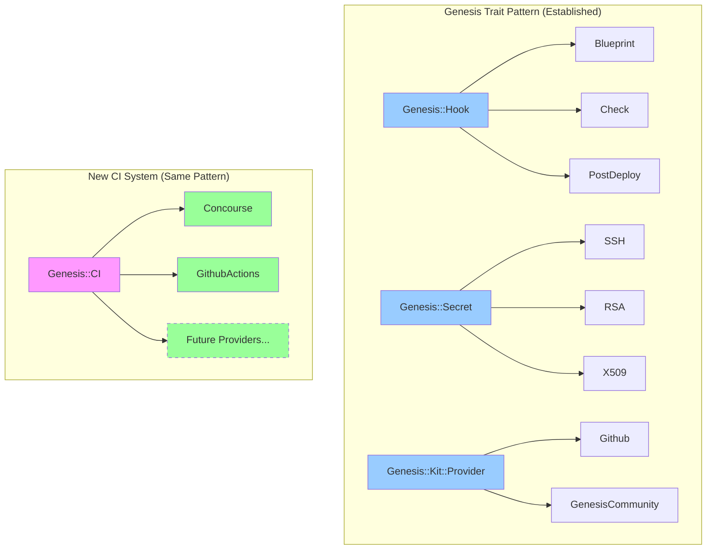
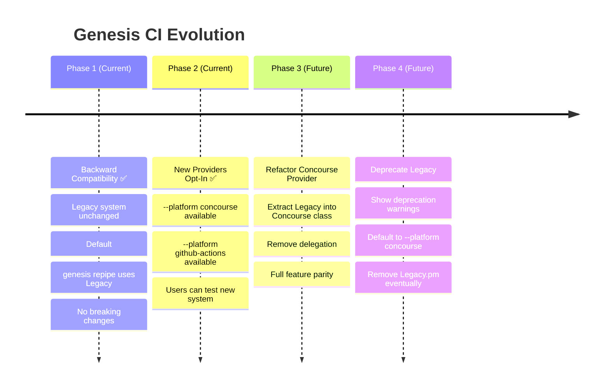

# Genesis CI System Architecture

## Overview

Genesis provides a CI/CD pipeline system that generates and deploys pipelines for continuous deployment of BOSH environments. This document explains the evolution from the monolithic Legacy system to the new trait-based multi-platform architecture.

```mermaid
graph LR
    A[ci.yml] --> B[Genesis::CI Factory]
    B -->|type: concourse| C[Concourse Provider]
    B -->|type: github-actions| D[GitHub Actions Provider]
    B -->|type: legacy| E[Legacy System]
    
    C --> F[Concourse YAML]
    D --> G[GitHub Actions Workflow]
    E --> F
    
    F -->|fly CLI| H[Concourse]
    G -->|git commit| I[GitHub Actions]
    
    style B fill:#181825,stroke:#fff,stroke-width:4px
    style C fill:#14532d,stroke:#fff,stroke-width:2px
    style D fill:#164e63,stroke:#fff,stroke-width:2px
    style E fill:#3f2e13,stroke:#fff,stroke-width:2px
```



---

## The Legacy System (Original)

### What It Was

`Genesis::CI::Legacy` was a monolithic Perl module (~1600 lines) that generated Concourse CI pipeline YAML configurations. It was the **only** CI platform supported by Genesis.

### What It Did

The Legacy system handled the complete Concourse pipeline generation workflow:

1. **Configuration Parsing** (`validate_pipeline()`)
   - Loaded `ci.yml` configuration files
   - Validated required fields (vault, git, boshes, notifications)
   - Normalized git authentication (SSH keys vs username/password)
   - Applied defaults (branches, commit authors, registry settings)

2. **Pipeline Generation** (`generate_pipeline_concourse_yaml()`)
   - Generated Concourse pipeline YAML with:
     - Git resources for code checkout
     - Vault authentication via AppRole
     - BOSH director configurations
     - Deployment jobs with dependency chains
     - Notification resources (Slack, Email)
     - Locker resources for deployment coordination
   - Supported complex layouts with environment progression (dev → staging → prod)
   - Handled auto-triggering vs manual deployments
   - Generated inline or grouped notifications

3. **Additional Features**
   - `generate_pipeline_graphviz_source()` - Visualize pipeline as DOT graph
   - `generate_pipeline_human_description()` - Human-readable pipeline summary

### How It Worked

```perl
# Single entry point
use Genesis::CI::Legacy;

# Parse configuration
my ($pipeline, $layout) = Genesis::CI::Legacy::parse('ci.yml', $top, 'default');

# Generate Concourse YAML
my $yaml = Genesis::CI::Legacy::generate_pipeline_concourse_yaml($pipeline, $top);

# Output directly used by fly CLI
```

**Workflow:**


### Limitations

1. **Tightly Coupled to Concourse** - All logic assumed Concourse primitives (resources, jobs, tasks)
2. **Monolithic** - Single 1600-line file with no separation of concerns
3. **No Extensibility** - Adding GitHub Actions would require duplicating/forking the entire codebase
4. **Hard to Test** - Concourse-specific YAML generation intertwined with validation logic
5. **No Abstraction** - Git config, Vault config, notifications all baked into Concourse YAML generation

---

## The New Trait-Based System

### Architecture Philosophy

The new system uses a **trait pattern** (like `Genesis::Hook`, `Genesis::Secret`, `Genesis::Kit::Provider`) where:
- A **factory** (`Genesis::CI`) instantiates the appropriate provider
- Each **provider** is a complete, self-contained implementation
- Providers implement a **contract** (trait interface) but share **no code**
- No branching logic (e.g., `if concourse { } elsif github-actions { }`)

### Structure

```
lib/Genesis/
├── CI.pm                      # Factory + trait interface definition
├── CI/
│   ├── Legacy.pm              # Original monolithic implementation (KEPT)
│   ├── Concourse.pm           # New Concourse provider (delegates to Legacy for now)
│   └── GithubActions.pm       # New GitHub Actions provider
```



```mermaid
classDiagram
    class Genesis_CI {
        <<Factory>>
        +new(type, file, top) Provider
    }
    
    class TraitInterface {
        <<Interface>>
        +init()
        +parse()
        +generate()
        +deploy()
        +platform_name()
        +file_extension()
    }
    
    class Concourse {
        -file
        -top
        -config
        +init()
        +parse()
        +generate() String
        +deploy()
        +graphviz() String
        +describe()
    }
    
    class GithubActions {
        -file
        -top
        -config
        +init()
        +parse()
        +generate() String
        +deploy()
    }
    
    class Legacy {
        <<Monolithic>>
        +parse()
        +generate_pipeline_concourse_yaml()
        +generate_pipeline_graphviz_source()
    }
    
    Genesis_CI --> TraitInterface : defines
    TraitInterface <|.. Concourse : implements
    TraitInterface <|.. GithubActions : implements
    Concourse ..> Legacy : delegates to (temporary)
    
    style Genesis_CI fill:#181825,stroke:#fff,stroke-width:2px
    style TraitInterface fill:#1e293b,stroke:#fff,stroke-width:2px
    style Concourse fill:#14532d,stroke:#fff,stroke-width:2px
    style GithubActions fill:#164e63,stroke:#fff,stroke-width:2px
    style Legacy fill:#3f2e13,stroke:#fff,stroke-width:2px
```

### CI Provider Contract

All providers must implement:

```perl
package Genesis::CI::<Platform>;
use parent 'Genesis::CI';

# Initialize provider instance
sub init { ... }

# Parse and validate configuration
sub parse { ... }

# Generate platform-specific pipeline/workflow
sub generate { ... }

# Deploy/upload to CI platform
sub deploy { ... }

# Return human-readable platform name
sub platform_name { ... }

# Return file extension for generated config
sub file_extension { ... }
```

### How It Works

#### 1. Factory Pattern

```perl
use Genesis::CI;

# Factory returns the appropriate provider
my $ci = Genesis::CI->new(
    type => 'concourse',      # or 'github-actions'
    file => 'ci.yml',
    top  => $top_obj,
);
```

**No branching in user code!** The factory handles instantiation.



#### 2. Provider Independence

Each provider is **completely self-contained**:

##### Concourse Provider
```perl
package Genesis::CI::Concourse;
use parent 'Genesis::CI';

sub init {
    # Concourse-specific initialization
}

sub parse {
    # Delegates to Legacy for now
    Genesis::CI::Legacy::parse(...)
}

sub generate {
    # Generates Concourse YAML
    Genesis::CI::Legacy::generate_pipeline_concourse_yaml(...)
}

sub deploy {
    # Uses fly CLI to upload pipeline
    # fly -t <target> set-pipeline ...
}
```

##### GitHub Actions Provider
```perl
package Genesis::CI::GithubActions;
use parent 'Genesis::CI';

sub init {
    # GitHub Actions-specific initialization
}

sub parse {
    # Parses ci.yml for GitHub Actions
    # Validates GitHub-specific requirements
}

sub generate {
    # Generates .github/workflows/*.yml
    # Uses GitHub Actions syntax (on:, jobs:, steps:)
}

sub deploy {
    # Writes workflow file to .github/workflows/
    # (No CLI upload needed for GitHub Actions)
}
```

**Key Point**: These two providers **share no code**. Each owns its entire implementation.

### Usage Examples

#### Legacy Mode (Backward Compatible)
```bash
# Uses Genesis::CI::Legacy directly
genesis repipe
genesis repipe --config ci.yml --target prod
```

#### New Concourse Provider
```bash
# Uses Genesis::CI::Concourse (delegates to Legacy internally)
genesis repipe --platform concourse
```

#### GitHub Actions Provider
```bash
# Uses Genesis::CI::GithubActions
genesis repipe --platform github-actions

# Generates .github/workflows/<pipeline-name>.yml
```

### Command Integration

`Genesis::Commands::Pipelines` routes to the appropriate provider:

```perl
sub repipe {
    my $platform = get_options->{platform} || 'legacy';
    
    if ($platform eq 'legacy') {
        # Use Legacy directly (backward compatibility)
        Genesis::CI::Legacy::parse(...);
        Genesis::CI::Legacy::generate_pipeline_concourse_yaml(...);
    } else {
        # Use trait-based system
        my $ci = Genesis::CI->new(type => $platform, ...);
        $ci->parse();
        $ci->deploy(...);
    }
}
```

---

## Comparison

| Aspect | Legacy System | New Trait System |
|--------|---------------|------------------|
| **Platforms** | Concourse only | Concourse, GitHub Actions, (extensible) |
| **Architecture** | Monolithic | Trait-based with factory |
| **Code Sharing** | N/A (single platform) | None (each provider self-contained) |
| **Extensibility** | Fork/duplicate code | Implement trait interface |
| **Testability** | Difficult (large monolith) | Easy (isolated providers) |
| **Lines of Code** | ~1600 in one file | ~200 (factory) + ~200-300 per provider |
| **Branching Logic** | N/A | **None** (polymorphism via traits) |
| **Backward Compat** | Default | Maintained via `--platform legacy` |

---

## Benefits of the New System

### 1. **Separation of Concerns**
Each provider handles only its platform's logic. No Concourse code in GitHub Actions provider, and vice versa.

### 2. **No Branching**
```perl
# BAD (old shared abstraction approach with branching)
sub generate_git_resource {
    if ($platform eq 'concourse') {
        return concourse_git_resource();
    } elsif ($platform eq 'github-actions') {
        return github_actions_checkout();
    }
}

# GOOD (trait pattern - each provider implements independently)
# Genesis::CI::Concourse
sub generate { ... generates Concourse YAML ... }

# Genesis::CI::GithubActions  
sub generate { ... generates GitHub Actions YAML ... }
```

### 3. **Easy to Extend**
Adding a new CI platform (e.g., GitLab CI, Jenkins):

```perl
package Genesis::CI::GitlabCI;
use parent 'Genesis::CI';

sub init { ... }
sub parse { ... }
sub generate { ... }      # Generate .gitlab-ci.yml
sub deploy { ... }        # Push to GitLab
sub platform_name { "GitLab CI" }
sub file_extension { ".yml" }
```

Register in factory:
```perl
# In Genesis::CI::new()
elsif ($type eq 'gitlab-ci') {
    require Genesis::CI::GitlabCI;
    return Genesis::CI::GitlabCI->init(%opts);
}
```



```mermaid
graph TB
    A[ci.yml] --> B{Genesis::CI Factory}
    
    B -->|type: concourse| C[Concourse Provider]
    B -->|type: github-actions| D[GitHub Actions Provider]
    B -->|type: gitlab-ci| E[GitLab CI Provider]
    B -->|type: jenkins| F[Jenkins Provider]
    B -->|type: custom| G[Custom Provider]
    
    C --> C1[parse<br/>generate<br/>deploy]
    D --> D1[parse<br/>generate<br/>deploy]
    E --> E1[parse<br/>generate<br/>deploy]
    F --> F1[parse<br/>generate<br/>deploy]
    G --> G1[parse<br/>generate<br/>deploy]
    
    C1 --> H1[fly CLI]
    D1 --> H2[.github/workflows/]
    E1 --> H3[.gitlab-ci.yml]
    F1 --> H4[Jenkinsfile]
    G1 --> H5[Custom Output]
    
    style B fill:#181825,stroke:#fff,stroke-width:4px
    style C fill:#14532d,stroke:#fff,stroke-width:2px
    style D fill:#164e63,stroke:#fff,stroke-width:2px
    style E fill:#1e293b,stroke:#fff,stroke-width:2px,stroke-dasharray: 5 5
    style F fill:#3f2e13,stroke:#fff,stroke-width:2px,stroke-dasharray: 5 5
    style G fill:#eab308,stroke:#fff,stroke-width:2px,stroke-dasharray: 5 5
```

### 4. **Testable**
Each provider can be tested independently:
```perl
# Test Concourse provider
my $ci = Genesis::CI->new(type => 'concourse', ...);
$ci->parse();
my $yaml = $ci->generate();
# Assert YAML contains expected Concourse resources

# Test GitHub Actions provider  
my $gh = Genesis::CI->new(type => 'github-actions', ...);
$gh->parse();
my $workflow = $gh->generate();
# Assert workflow contains expected GHA jobs
```

### 5. **Follows Genesis Patterns**
Matches existing Genesis architecture:
- `Genesis::Hook` → `Genesis::Hook::{Blueprint,Check,PostDeploy}`
- `Genesis::Secret` → `Genesis::Secret::{SSH,RSA,X509}`
- `Genesis::Kit::Provider` → `Genesis::Kit::Provider::{Github,GenesisCommunity}`
- `Genesis::CI` → `Genesis::CI::{Concourse,GithubActions}`



---

## Migration Path



### Phase 1: **Backward Compatibility** ✅
- Legacy system remains unchanged
- Default behavior unchanged (`genesis repipe` uses Legacy)
- No breaking changes

### Phase 2: **New Providers Opt-In** ✅
```bash
# Users can try new providers
genesis repipe --platform concourse     # Uses new trait system
genesis repipe --platform github-actions
```

### Phase 3: **Refactor Concourse Provider** (Future)
Currently, `Genesis::CI::Concourse` delegates to `Legacy`:
```perl
sub generate {
    return Genesis::CI::Legacy::generate_pipeline_concourse_yaml(...);
}
```

Future: Extract Legacy logic into Concourse provider directly:
```perl
sub generate {
    # Self-contained Concourse YAML generation
    # No dependency on Legacy
}
```

### Phase 4: **Deprecate Legacy** (Future)
Once Concourse provider is fully refactored:
```bash
# Legacy mode shows deprecation warning
genesis repipe  # WARN: Using legacy mode, consider --platform concourse

# Eventually becomes alias
genesis repipe  # Automatically uses --platform concourse
```

---

## Configuration Format

The `ci.yml` format remains largely compatible, with optional platform-specific sections:

```yaml
pipeline:
  name: my-deployment-pipeline
  platform: concourse  # Optional: concourse | github-actions (default: concourse)
  
  # Platform-agnostic configuration
  vault:
    url: https://vault.example.com
    namespace: deployments
  
  git:
    owner: my-org
    repo: my-deployments
    branch: main
    private_key: ((git-private-key))
  
  slack:
    webhook: ((slack-webhook))
    channel: "#deployments"
  
  boshes:
    dev:
      url: https://bosh-dev.example.com
      username: admin
      password: ((bosh-password))
      alias: dev
  
  # Platform-specific overrides (optional)
  concourse:
    public: true
    task:
      image: starkandwayne/genesis
      version: latest
  
  github-actions:
    runs-on: ubuntu-latest
    concurrency:
      group: deployments
      cancel-in-progress: false
```

---

## Developer Guide

### Adding a New CI Platform

1. **Create Provider Class**
```perl
package Genesis::CI::MyPlatform;
use v5.20;
use warnings;
use parent 'Genesis::CI';

sub init {
    my ($class, %opts) = @_;
    return bless({ file => $opts{file}, top => $opts{top} }, $class);
}

sub parse {
    my ($self) = @_;
    # Parse ci.yml for your platform
    # Validate platform-specific requirements
}

sub generate {
    my ($self) = @_;
    # Generate platform-specific config (YAML, JSON, etc.)
}

sub deploy {
    my ($self, %opts) = @_;
    # Upload/activate pipeline on platform
}

sub platform_name { "My Platform" }
sub file_extension { ".yml" }

1;
```

2. **Register in Factory**
```perl
# In lib/Genesis/CI.pm
sub new {
    # ...
    elsif ($type eq 'my-platform') {
        require Genesis::CI::MyPlatform;
        return Genesis::CI::MyPlatform->init(%opts);
    }
}
```

3. **Test**
```perl
my $ci = Genesis::CI->new(type => 'my-platform', file => 'ci.yml', top => $top);
$ci->parse();
my $config = $ci->generate();
# Assert config is valid for your platform
```

4. **Use**
```bash
genesis repipe --platform my-platform
```

### Testing Providers

```perl
# Test Concourse provider matches Legacy output
my $legacy_yaml = Genesis::CI::Legacy::generate_pipeline_concourse_yaml(...);
my $ci = Genesis::CI->new(type => 'concourse', ...);
$ci->parse();
my $new_yaml = $ci->generate();
is($new_yaml, $legacy_yaml, "Concourse provider matches Legacy");

# Test GitHub Actions generates valid workflow
my $gh = Genesis::CI->new(type => 'github-actions', ...);
$gh->parse();
my $workflow = load_yaml($gh->generate());
ok($workflow->{jobs}, "Workflow has jobs");
ok($workflow->{on}, "Workflow has triggers");
```